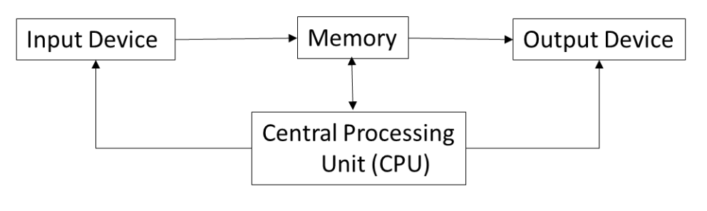

# Chapter 1: Introduction to Signals and Number Systems

_Originally created 24 December, 2020 by Maxwell Hauser — Updated 4 October, 2025_

---

## Introduction

We interact with numerical values every day. These numerical values can be represented in different forms: either **analog** or **digital**.

- An example of an analog signal is an analog watch (the ones with physical, moving hour and minute hands).
- An example of a digital signal is a digital watch or thermometer.

**Advantages of digital representation over analog:**

1. Digital representation is more accurate.
2. It can be stored easily.
3. Digital systems are easier to design.
4. Noise has less effect.
5. Digital systems can easily be fabricated in an integrated circuit.

Digital signals are **discrete signals** (step-by-step) and analog signals are **continuous signals**.

We use digital systems widely in devices such as computers, calculators, and cell phones. In a digital system, information is transferred between the components in the form of digital signals.

### Computer Components

A computer is made of two different types of components: **hardware** and **software**.

- **Hardware** refers to the physical components of the computer, such as a keyboard, CPU, and memory.
- **Software** refers to the programs run by the CPU, such as the operating system and application programs.

Computers come in many different forms, such as desktop, laptop, tablet, server, and smartphone. The basic structures of all of them are the same. The figure below shows the basic components of a computer:

> 

---

## Objectives

After completing this chapter, you should be able to:

1. Explain the basic components of a computer
2. Distinguish between analog and digital signals
3. Understand the characteristics of signals
4. Convert decimal numbers to binary and vice versa
5. Understand addition and subtraction of binary numbers
6. Represent floating-point numbers in binary
7. Convert from binary to hexadecimal and vice versa
8. Distinguish between serial and parallel transmission
9. Explain the basic components of a digital system

---

## Definitions
1. Signal
    - A signal is a function that conveys information about a phenomenon. It can be a function of time, space, or any other independent variable.

2. System
    - A system is a set of components that interact with each other to process signals. It can be physical (like an electronic circuit) or abstract (like a mathematical model).

3. Continuous-time signal
   - A continuous-time signal is a signal that is defined for all values of time. It can take on any value in a given range.

4. Discrete-time signal
   - A discrete-time signal is a signal that is defined only at discrete points in time. It is typically obtained by sampling a continuous-time signal.

5. Analog signal
   - An analog signal is a continuous-time signal that can take on any value within a given range. It is often represented by a smooth waveform.

6. Digital signal
   - A digital signal is a discrete-time signal that can take on only a finite number of values. It is typically represented by a sequence of binary numbers.

7. Input device
   - An input device is a hardware component that allows users to enter data and commands into a computer. Examples include keyboards, mice, scanners, and microphones.

8. Output device
   - An output device is a hardware component that receives data from a computer and presents it to the user. Examples include monitors, printers, and speakers.

9. Memory
   - Memory is a hardware component that stores data and instructions for the CPU to access. It can be volatile (like RAM) or non-volatile (like hard drives and SSDs).

10. Central Processing Unit (CPU)
      - The CPU is the primary component of a computer that performs most of the processing inside the computer. It carries out instructions from programs and performs calculations.

11. Binary number system
      - The binary number system is a base-2 numeral system that uses only two digits, 0 and 1. It is the foundation of digital computing and is used to represent all data in computers.

12. Decimal number system
      - The decimal number system is a base-10 numeral system that uses ten digits, 0 through 9. It is the most commonly used number system in everyday life.

13. Hexadecimal number system
     - The hexadecimal number system is a base-16 numeral system that uses sixteen symbols: 0-9 and A-F. It is often used in computing as a more human-friendly representation of binary-coded values.

14. Floating-point representation
      - Floating-point representation is a method of representing real numbers in a way that can support a wide range of values. It consists of a sign bit, an exponent, and a mantissa (or significand).

15. Serial transmission
      - Serial transmission is a method of transmitting data one bit at a time over a single communication channel. It is commonly used for long-distance communication.

16. Parallel transmission
      - Parallel transmission is a method of transmitting multiple bits of data simultaneously over multiple communication channels. It is typically used for short-distance communication, such as within a computer.

## Examples

**Example 1:** Convert the decimal number $(45)_{10}$ to binary.

Using the method of successive division by 2:

- $45 \div 2 = 22$ remainder $1$
- $22 \div 2 = 11$ remainder $0$
- $11 \div 2 = 5$ remainder $1$
- $5 \div 2 = 2$ remainder $1$
- $2 \div 2 = 1$ remainder $0$
- $1 \div 2 = 0$ remainder $1$

Reading the remainders from bottom to top: $(101101)_2$

**Result:** $(45)_{10} = (101101)_2$

---

**Example 2:** Convert the binary number $(110101)_2$ to decimal.

Using the method of positional notation:

$$(110101)_2 = (1 \times 2^5) + (1 \times 2^4) + (0 \times 2^3) + (1 \times 2^2) + (0 \times 2^1) + (1 \times 2^0)$$
$$= 32 + 16 + 0 + 4 + 0 + 1$$
$$= 53$$

**Result:** $(110101)_2 = (53)_{10}$

## Exercises
1. Explain the difference between analog and digital signals.

2. Explain the difference between time-domain and frequency-domain representations of signals.

3. Given the continuous-time signal x(t) = e^(-2t)u(t), find its Laplace transform.

4. For the discrete-time signal x[n] = (0.5)^n u[n], find its Z-transform.

5. Discuss the concept of linearity in systems. Provide examples of linear and nonlinear systems.

6. Explain the importance of the sampling theorem in signal processing.

7. Given a system described by the difference equation y[n] = 0.5y[n-1] + x[n], find its impulse response.

8. Discuss the role of convolution in the analysis of linear time-invariant (LTI) systems.

9. Given a continuous-time signal x(t), describe the process of finding its Fourier series representation.

10. Explain the concept of modulation and its applications in communication systems.

11. Describe the basic components of a digital system and their functions.
